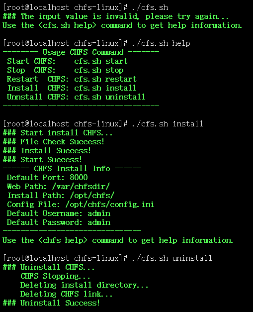
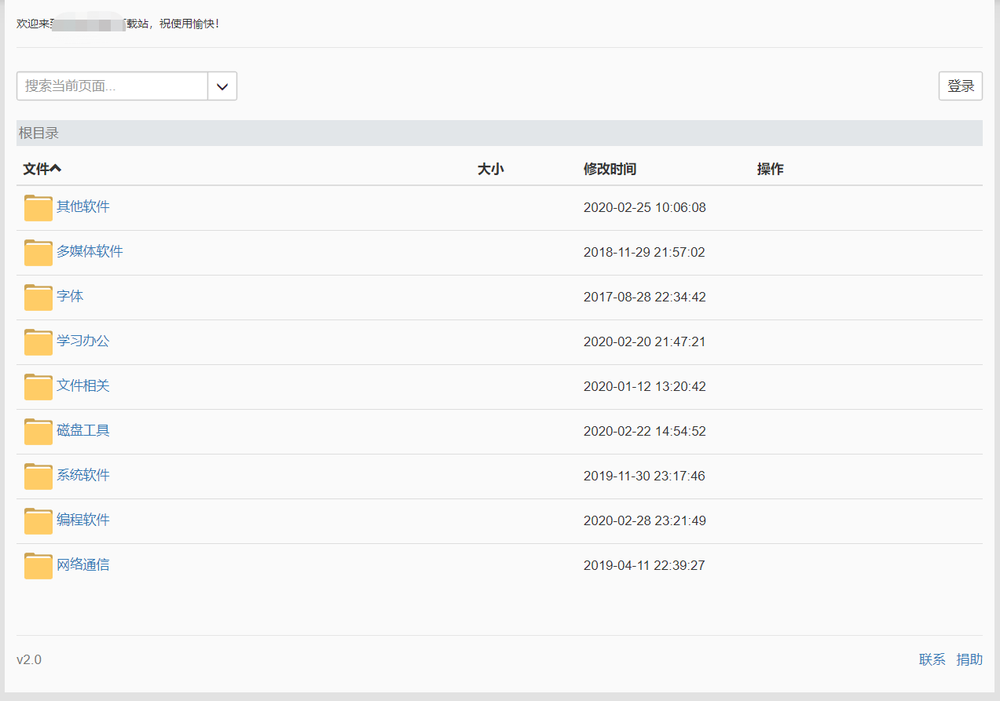

## CHFS for linux
CuteHttpFileServer/chfs是一个免费的、HTTP协议的文件共享服务器，使用浏览器可以快速访问。它具有以下特点：

- 单个文件，整个软件只有一个可执行程序，无配置文件等其他文件
- 跨平台运行，支持主流平台：Windows，Linux和Mac
- 界面简洁，简单易用
- 支持扫码下载和手机端访问，手机与电脑之间共享文件非常方便
- 支持账户权限控制和地址过滤
- 支持快速分享文字片段
- 支持webdav协议           

官方网站：http://iscute.cn/chfs


### 安装
克隆本项目，在项目目录下执行 `./cfs.sh install` 开始安装，请保证文件`cfs.sh`、`chfs`、`config.ini`、`chfs.service`在同一目录下，脚本会校验文件是否存在，多次安装不会删除先前创建的共享根目录文件夹。                      

默认安装路径：`/opt/chfs/`                               

默认共享路径：`/var/chfsdir/`                  

配置文件：`/opt/chfs/config.ini`                                    


目录结构如下：           

```
── chfs-linux
   ├── cfs.sh
   ├── chfs
   ├── chfs.service
   ├── config.ini
   ├── config_sample.ini
   ├── README.md
   └── ssl
```


**注：该脚本适用于CentOS!!!其他系统请自行参考官方配置。CentOS7+以systemd管理服务且可使用systemctl命令启动/停止/重启服务，CentOS6使用screen管理服务且使用命令说明中的命令管理服务，安装时默认添加到开机自启动。cfs.sh 文件中 `webdir="/var/chfsdir/"` 可自定义共享目录，默认安装到`/var/chfsdir/`目录，目录为绝对路径且需要加 `/`。**                    

​                                     

### 卸载
执行 `cfs.sh uninstall` 卸载CHFS，卸载不会删除共享根目录文件夹。                


### 命令说明         
通用命令：              
```
cfs.sh start		   //启动
cfs.sh stop		       //停止
cfs.sh restart		   //重启
cfs.sh help		       //帮助
cfs.sh install		   //安装
cfs.sh uninstall	   //卸载
```


若是centos7+可使用以下命令：                 

```
systemctl start chfs		//启动
systemctl stop chfs			//停止
systemctl restart chfs		//重启
systemctl enable chfs		//开机自启
systemctl disable chfs		//取消开机自启
```


###  程序截图

脚本配置界面：                 




Web访问界面：                 



### 文件说明

```
cfs.sh			//安装配置脚本
chfs			//主程序
config.ini		//配置文件
config_sample.ini		//配置文件模板
chfs.service			//CentOS7+ 服务配置文件
README.md				//说明页面
```


### 配置文件模板

```
#---------------------------------------
# 请注意：
#     1，如果不存在键或对应值为空，则不影响对应的配置
#     2，配置项的值，语法如同其对应的命令行参数
#---------------------------------------


# 监听端口
port=


# 共享根目录，通过字符'|'进行分割
# 注意：
#     1，带空格的目录须用引号包住，如 path="c:\a uply name\folder"
#     2，可配置多个path，分别对应不同的目录
path=


# IP地址过滤
allow=


#----------------- 账户控制规则 -------------------
# 注意：该键值可以同时存在多个，你可以将每个用户的访问规则写成一个rule，这样比较清晰，如：
#     rule=::
#     rule=root:123456:RW
#     rule=readonlyuser:123456:R
rule=


# 用户操作日志存放目录，默认为空
# 如果赋值为空，表示禁用日志
log=


# 网页标题
html.title=


# 网页顶部的公告板。可以是文字，也可以是HTML标签，此时，需要适用一对``(反单引号，通过键盘左上角的ESC键下面的那个键输出)来包住所有HTML标签。几个例子：
#     1,html.notice=内部资料，请勿传播
#     2,html.notice=``
#     3,html.notice=`<div style="background:black;color:white"><p>目录说明：</p><ul>一期工程：一期工程资料目录</ul><ul>二期工程：二期工程资料目录</ul></div>`
html.notice=


# 是否启用图片预览(网页中显示图片文件的缩略图)，true表示开启，false为关闭。默认开启
image.preview=


# 下载目录策略。disable:禁用; leaf:仅限叶子目录的下载; enable或其他值:不进行限制。
# 默认值为 enable
folder.download=


#-------------- 设置生效后启用HTTPS，注意监听端口设置为443-------------
# 指定certificate文件
ssl.cert=
# 指定private key文件
ssl.key=


# 设置会话的生命周期，单位：分钟，默认为30分钟
session.timeout=
```

